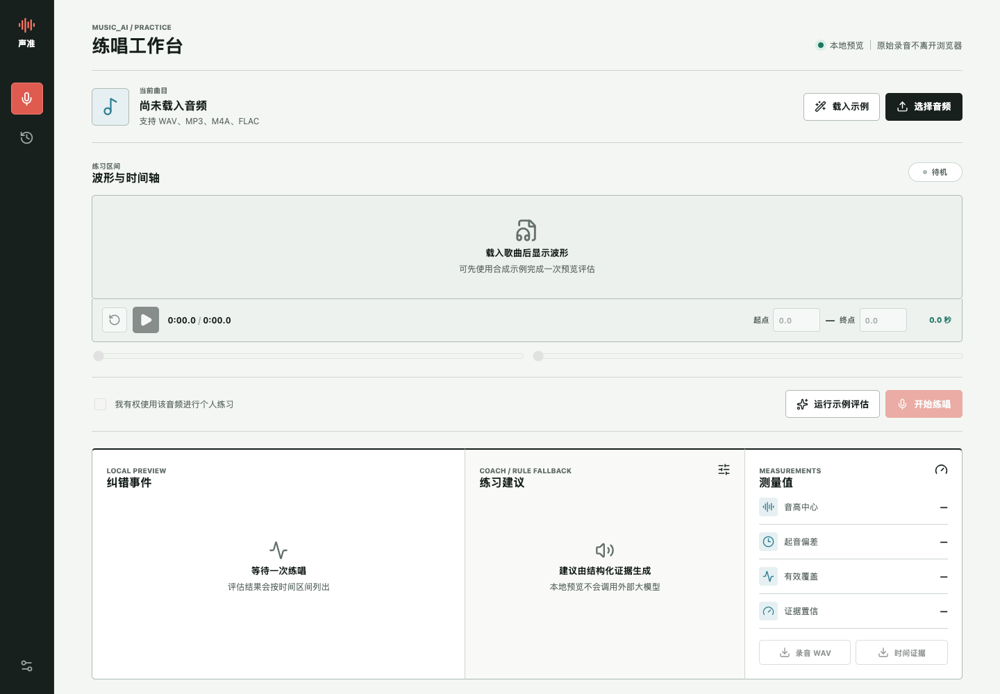
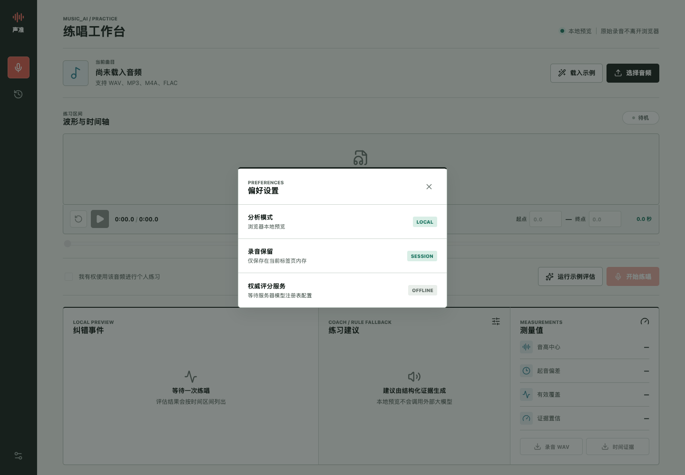
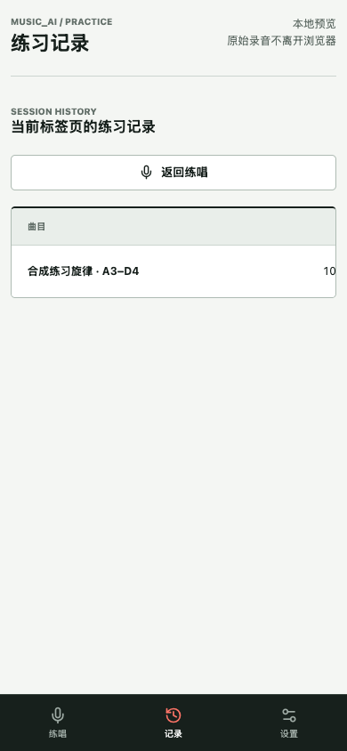
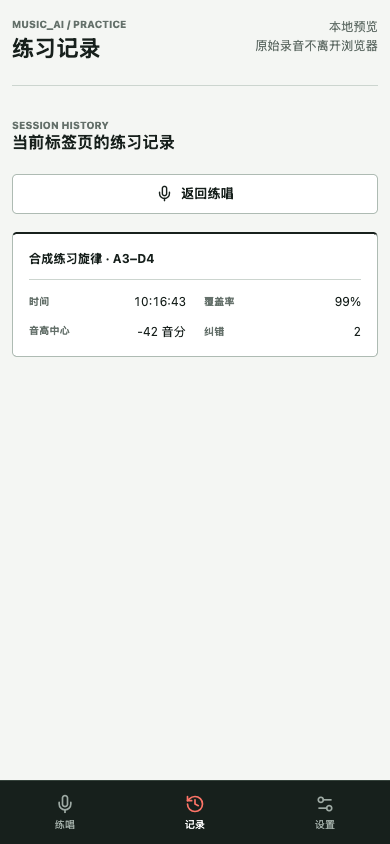
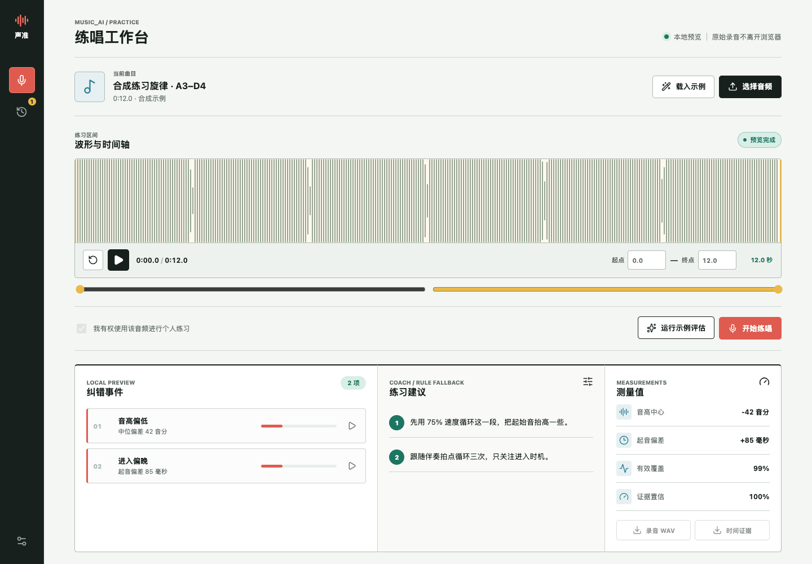

# Dogfood Report: Music AI Practice Workbench

| Field | Value |
|-------|-------|
| **Date** | 2026-07-11 |
| **App URL** | http://127.0.0.1:3001 |
| **Session** | music-ai-web |
| **Scope** | Demo practice, analysis, history, settings, responsive layout, microphone denial |

## Summary

| Severity | Count |
|----------|-------|
| Critical | 0 |
| High | 0 |
| Medium | 2 |
| Low | 0 |
| **Total** | **2** |

## Issues

### ISSUE-001: Settings dialog ignores Escape

| Field | Value |
|-------|-------|
| **Severity** | medium |
| **Category** | accessibility / ux |
| **URL** | http://127.0.0.1:3001/ |
| **Repro Video** | N/A - local ffmpeg executable unavailable; step screenshots captured |
| **Status** | Resolved and verified |

**Description**

The settings dialog remained open after pressing Escape. Keyboard users had to navigate to the close button, and focus was not explicitly moved into or restored from the modal.

**Repro Steps**

1. Open the practice workbench.
   

2. Activate the settings button and observe the dialog.
   

3. Press Escape. The dialog remains open instead of closing.
   

**Fix Verification**

The dialog now focuses its close button on open, traps Tab focus, closes on Escape, and restores focus to the settings trigger. Browser verification observed zero open dialogs after Escape and the settings trigger as the active element.

---

### ISSUE-002: Practice metrics are clipped on mobile history

| Field | Value |
|-------|-------|
| **Severity** | medium |
| **Category** | responsive / ux |
| **URL** | http://127.0.0.1:3001/ |
| **Repro Video** | N/A - static visible issue |
| **Status** | Resolved and verified |

**Description**

At a 390 px viewport, the desktop-width history row overflows horizontally. Only the song and part of the time are initially visible, while coverage, pitch, and correction count are hidden without a scroll affordance.

**Repro Steps**

1. Complete the demo assessment at a 390 x 844 viewport.
2. Open the mobile History tab and observe the clipped row.
   

**Fix Verification**

The mobile row now uses a two-column metric summary with explicit cell semantics. All values fit at 390 x 844 without horizontal scrolling.

## Test Notes

- Desktop workflow passed at 1440 x 1000: demo loading, waveform rendering, assessment, coaching, metrics, history, and settings.
- Mobile workflow passed at 390 x 844: practice controls, stacked results, history summary, settings, scrolling, and fixed navigation.
- No application console errors or failed requests were observed.
- Chromium's native microphone prompt could not be rejected through the browser automation interface, so the denial and resource-cleanup path is covered by an isolated automated test.
- The final timing fix records its first transport anchor only after playback starts and removes microphone pre-roll before local onset analysis. The Web suite now has 12 passing tests.

